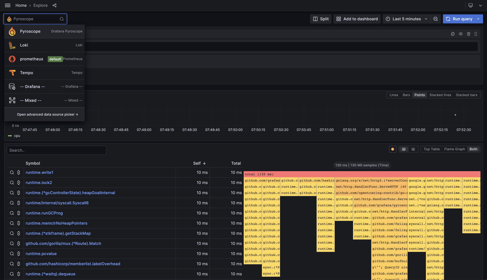
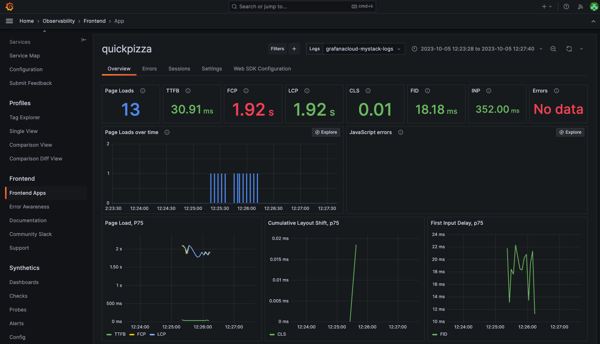

# QuickPizza


## What is QuickPizza? 🍕🍕🍕

`QuickPizza` is a web application, used for demonstrations and workshops, that generates new and exciting pizza combinations! 

The app is built using [SvelteKit](https://kit.svelte.dev/) for the frontend and [Go](https://go.dev/) for the backend.

The tests written for `QuickPizza` demonstrates the basic and advanced functionalities of k6, ranging from a basic load test to using different modules and extensions.

## Requirements

- [Docker](https://docs.docker.com/get-docker/)
- [Grafana k6](https://k6.io/docs/get-started/installation/) (v.0.46.0 or higher)

## Run locally with Docker

To run the app locally with Docker, run the command:

```bash
docker run --rm -it -p 3333:3333  ghcr.io/grafana/quickpizza-local:latest
```

or build image from the repo:

```bash
docker run --rm -it -p 3333:3333 $(docker build -q .)
```

That's it!

Now you can go to [localhost:3333](http://localhost:3333) and get some pizza recommendations!

## Use k6 to test QuickPizza

All tests live in the `k6` folder. Within this folder, you will find the following folders:

- [foundations](k6/foundations/) - covers the basic functionalities of k6.
- [browser](k6/browser/) - covers the [k6 browser module](https://k6.io/docs/using-k6-browser/overview/) for browser and web performance testing.
- [extensions](k6/extensions/) - covers basic tests using [k6 extensions](https://k6.io/docs/extensions/).
- [disruptor](k6/disruptor/) - covers a more deep-dive look on how to use [xk6-disruptor](https://k6.io/docs/javascript-api/xk6-disruptor/) for failure injection testing.
- [advanced](k6/advanced) - covers tests that are more advanced such as hybrid tests, tracing, etc.

To run tests on the `foundations` folder, you can use the following commands:

```bash
cd k6/foundations
k6 run 01.basic.js
```

If you want to run one iteration with one virtual user, you can use the following command:

```bash
k6 run --iterations 1 --vus 1 01.basic.js
```

If QuickPizza is [deployed remotely](#deploy-quickpizza-docker-image), then pass the hostname and port through the `BASE_URL` environment variable as follows:

```bash
k6 run -e BASE_URL=https://acmecorp.dev:3333 01.basic.js
```

If the test uses an extension, you need to build a k6 binary that includes the required extension/s. For detailed instructions, refer to k6 docs:
- [Build a k6 binary using Go](https://k6.io/docs/extensions/guides/build-a-k6-binary-using-go/)
- [Build a k6 binary using Docker](https://k6.io/docs/extensions/guides/build-a-k6-binary-using-docker/)

```bash
cd k6/extensions

xk6 build --with xk6-internal=../internal
```

To run the test that uses the `k6/x/internal` module, use  previously created k6 binary in the `k6/extensions` folder:

```bash
./k6 run 01.basic-internal.js
```

## Collect telemetry (Docker Compose)

Testing something you can't observe is only half the fun. QuickPizza is instrumented using best practices to record logs, emit metrics, traces and allow profiling. You can either collect and [store this data locally](#local-setup) or send it to [Grafana Cloud](#grafana-cloud).

First, we need to install the [Loki docker plugin](https://grafana.com/docs/loki/latest/send-data/docker-driver/) to be able to read the logs from the QuickPizza container. Run the following command, updating the release version if needed:

```bash
docker plugin install grafana/loki-docker-driver:2.9.1 --alias loki --grant-all-permissions
```

> Note that Docker plugins are not supported on Windows, meaning QuickPizza logs won't be sent to Loki with the Docker Compose setup. When executing `docker compose up` on Windows, either pass the env. variable: `LOGGING_DRIVER=none`, or remove the `services/quickpizza/logging` section from the `docker-compose-*.yaml` files.

### Local Setup

The [docker-compose-local.yaml](./docker-compose-local.yaml) file is set up to run and orchestrate the QuickPizza, Grafana, Tempo, Loki, Prometheus, Pyroscope, and Grafana Agent containers.

The Grafana Agent collects traces, metrics, and profiling data from the QuickPizza app, forwarding them to the Tempo, Prometheus, and Pyroscope services. The Loki Docker plugin reads the logs and forwards them to the Loki service. Finally, you can visualize and correlate data stored in these containers with the locally running Grafana instance. 


First, if you haven't done so in the previous step, install the `Loki Docker plugin`. To start the local environment, use the following command:

```bash
docker compose -f docker-compose-local.yaml up -d
```

Like before, QuickPizza is available at [localhost:3333](http://localhost:3333). It's time to discover some fancy pizzas!

Then, you can visit the Grafana instance running at [localhost:3000](http://localhost:3000) to access QuickPizza data.



Please refer to [agent-local.river](./contrib/agent-local.river) and [docker-compose-local.yaml](./docker-compose-local.yaml) to find the labels applied to the telemetry data.

**Send k6 results to Prometheus and visualize them with prebuilt dashboards**

To send k6 results to the Prometheus instance, execute the `k6 run` command with the value of the `output` flag set to `experimental-prometheus-rw` as follows:

```bash
k6 run -o experimental-prometheus-rw 01.basic.js
```

The local Grafana instance includes the [k6 Prometheus](https://grafana.com/grafana/dashboards/19665-k6-prometheus/) and [k6 Prometheus (Native Histogram)](https://grafana.com/grafana/dashboards/18030-k6-prometheus-native-histograms/) dashboards to help visualize, query, and correlate k6 results with telemetry data.


For detailed instructions about the different options of the k6 Prometheus output, refer to the [k6 output guide for Prometheus remote write](https://k6.io/docs/results-output/real-time/prometheus-remote-write).


### Grafana Cloud

The [docker-compose-cloud.yaml](./docker-compose-cloud.yaml) file is set up to run the QuickPizza and Grafana Agent containers. 

In this setup, the Grafana Agent collects observability data from the QuickPizza app and forwards it to [Grafana Cloud](https://grafana.com/products/cloud/).

You will need the following settings:
1. The name of the [Grafana Cloud Stack](https://grafana.com/docs/grafana-cloud/account-management/cloud-portal/#your-grafana-cloud-stack) where the telemetry data will be stored. 
2. An [Access Policy Token](https://grafana.com/docs/grafana-cloud/account-management/authentication-and-permissions/access-policies/) that includes the following scopes for the selected Grafana Cloud Stack: `stacks:read`, `metrics:write`, `logs:write`, `traces:write`, and `profiles:write`.
3. Loki user and Loki host for basic authentication. Navigate to the Grafana Cloud Stack on the [Cloud Portal](https://grafana.com/docs/grafana-cloud/fundamentals/cloud-portal/) and click the Loki `Details`. 

Then, create an `.env` file with the following environment variables and the values of the previous settings:

```bash
GRAFANA_CLOUD_STACK=name
GRAFANA_CLOUD_TOKEN=
GRAFANA_CLOUD_LOKI_USER=123456
GRAFANA_CLOUD_LOKI_HOST=logs-prod-XYZ.grafana.net
```

Before running Docker Compose, install the `Loki Docker plugin` if you haven't done so previously. Finally, execute the Docker Compose command using the `docker-compose-cloud.yaml` file, just as in the local setup:

```bash
docker compose -f docker-compose-cloud.yaml up -d
```

QuickPizza is available at [localhost:3333](http://localhost:3333). Click the `Pizza, Please!` button and discover some awesome pizzas!

Now, you can log in to [Grafana Cloud](https://grafana.com/products/cloud/) and explore QuickPizza's telemetry data on the Prometheus, Tempo, Loki, and Pyroscope instances of your Grafana Cloud Stack. Refer to [agent-cloud.river](./contrib/agent-cloud.river) and [docker-compose-cloud.yaml](./docker-compose-cloud.yaml) to find the labels applied to the telemetry data.

***Enable Frontend observability (Grafana Faro)***

Frontend observability is available exclusively in Grafana Cloud. To enable [Grafana Cloud Frontend Observability](https://grafana.com/docs/grafana-cloud/monitor-applications/frontend-observability/) for QuickPizza, add the `QUICKPIZZA_CONF_FARO_URL` variable to the `.env` file, setting its value to your Faro web URL:

```bash
QUICKPIZZA_CONF_FARO_URL=
```

Restart the `docker-compose-cloud.yaml` environment.



**Send k6 results to Grafana Cloud Prometheus and visualize them with prebuilt dashboards**

Just like in the local setup, we can output k6 result metrics to a Prometheus instance; in this case, it is provided by our Grafana Cloud Stack. 

```bash
K6_PROMETHEUS_RW_USERNAME=USERNAME \
K6_PROMETHEUS_RW_PASSWORD=API_KEY \
K6_PROMETHEUS_RW_SERVER_URL=REMOTE_WRITE_ENDPOINT \
k6 run -o experimental-prometheus-rw script.js
```

For detailed instructions, refer to the [k6 output guide for Grafana Cloud Prometheus](https://k6.io/docs/results-output/real-time/grafana-cloud-prometheus/).

## Deploy QuickPizza Docker image

The [Dockerfile](./Dockerfile) contains the setup for running QuickPizza without collecting data with the Grafana agent. 

You can use the Dockerfile or build a Docker image to deploy the QuickPizza app on any cloud provider that supports Docker deployments. For simplicity, here are the `Fly.io` instructions:

1. [Authenticate using the fly CLI](https://fly.io/docs/speedrun/). 
2. Then, run the CLI to deploy the application and set up the internal port `3333` that the server listens to.
    ```bash
    fly launch --internal-port 3333 --now
    ```

For deployments on remote servers, you need to pass the `BASE_URL` environment variable when running the k6 tests as follows:

```bash
k6 run -e BASE_URL=https://acmecorp.dev:3333 01.basic.js
```

## Deploy application to Kubernetes

If you want to run a test that uses [xk6-disruptor](https://k6.io/docs/javascript-api/xk6-disruptor/), or want to experiment with distributed tracing, you will need to deploy QuickPizza to Kubernetes. 

For a detailed setup instructions, see the [QuickPizza Kubernetes guide](./docs/kubernetes-setup.md).
